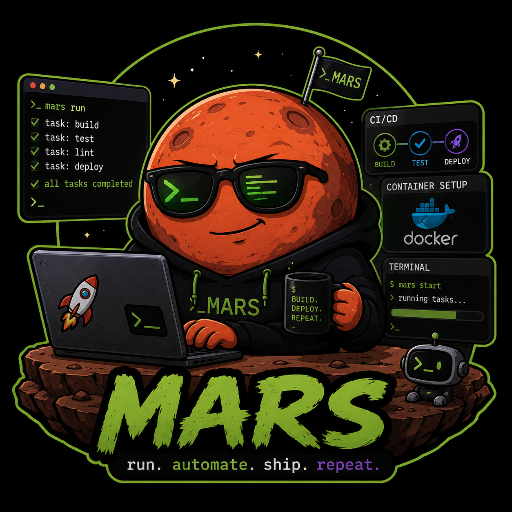
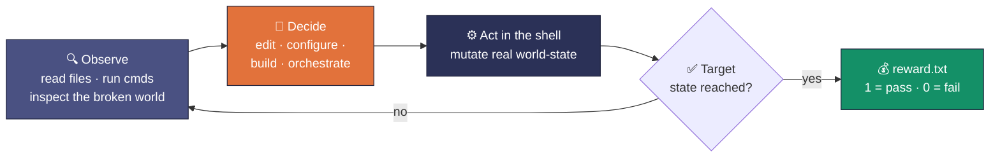
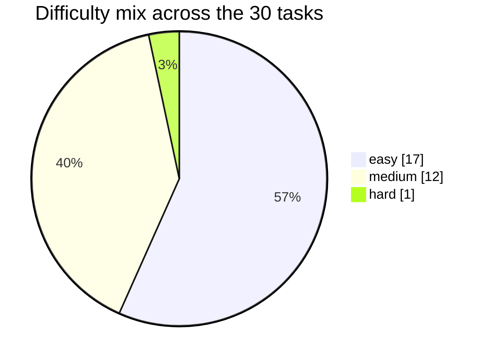

<div align="center">



# Mars · Terminal Operations (CLI) RL Environment

**🔍 Diagnose. &nbsp;🛠️ Repair. &nbsp;📦 Build. &nbsp;✅ Verify.**

> **Agentic RL environment for terminal-native policies · 30 sandboxed shell tasks ·
> each a live containerized world graded by deterministic checks · verifiable pass/fail reward · every task pinned by a working oracle.**


| 🗂️ **30** | 🐳 **30** | 🎯 **30** | 🧩 **3** | ✅ **{0, 1}** |
|:---:|:---:|:---:|:---:|:---:|
| tasks in the batch | containerized task worlds | oracle solves (attainability pinned) | task domains | binary verifiable reward |

*Every task is a small broken or unfinished machine. The policy gets a shell, makes the world right, and the world itself scores it.*

</div>

---

## TL;DR

- **What it is.** A reinforcement-learning *environment* for terminal-native agents — not a quiz. Each task drops a policy into a seeded Linux container with a concrete broken/unfinished world (a failing build, a misconfigured compose stack, hostile filenames, a mangled dependency graph) and one job: **act through the shell until the world satisfies the target state.**
- **Reward signal.** A **verifiable pass/fail scalar** written by the environment itself — `tests/test.sh` runs deterministic in-container checks and emits `reward.txt` (`1`/`0`). No human in the loop and no model-judge; each task also carries an integrity check that rejects trivially-gamed states — the policy must actually *make the machine work*.
- **Every task is pinned.** Each ships a working oracle (`solution/solve.sh`) that drives the reward to `1` (pass), so a passing state is demonstrated-attainable on all 30 — the signal is real, not aspirational.
- **Built for training.** 30 tasks span three terminal domains and three difficulty grades under **one uniform contract**, so the batch drops straight into a rollout loop as a curriculum. Raw trajectories from two frontier policies (`opus-4.8`, `gpt-5.6-sol`) ship with the full delivery (not in this sample) for warm-starts and reward-model data.

---

## ✨ At a glance

| Field | Value |
| --- | --- |
| Environment | **Mars** — sandboxed terminal worlds, one container per task |
| Policy interface | A shell in the task container; act until the target world-state holds |
| Tasks | 30, uniform contract |
| Objective | Reach each task's specified end-state (fixed build, healthy stack, correct outputs, …) |
| Reward | **Binary pass/fail ∈ `{0, 1}`**, written by deterministic in-container checks (standard entry `tests/test.sh` → `reward.txt`); shapeable to partial-credit |
| Attainability | 1 oracle `solve.sh` per task, driving reward to `1` (pass) |
| Isolation | Per-task Docker image (`docker_image` in `task.toml`), bounded CPU / memory / storage, network access |
| Reference rollouts | `opus-4.8` and `gpt-5.6-sol`, one run per task — **ship with the full delivery, not this sample** |
| License | MIT, © 2026 Ethara.AI |

---

## 🎯 Why this environment

- **Long-tail terminal competence is where policies separate.** Reading a stack trace, forming a hypothesis, editing config, re-running, and confirming the fix is a multi-step decision problem under partial observability — exactly the regime RL improves and single-shot prompting does not.
- **The reward can't be gamed.** The signal is the machine's own behavior: the build compiles or it doesn't; the container is healthy or it isn't; the bytes match or they don't. A policy earns reward only by producing a genuinely correct world-state.
- **Shapeable, not just pass/fail.** Each task's check battery is several independent assertions, so partial-credit reward is a config change away — the batch supports sparse terminal reward today and shaped reward for curriculum work.
- **One contract, many worlds.** Identical layout and grading envelope across all 30 tasks means the batch scales as a training set and extends cleanly to new tasks.

---

## 🤝 The policy's contract

Each task is a self-contained container world. The loop a policy runs:



- **Input.** `instruction.md` — the ask, in plain terms (rename a directory of hostile filenames deterministically; make a failing CI job pass; get a rootless Podman UID map right).
- **World.** `environment/` — a `Dockerfile` plus the seeded app/state the policy operates on.
- **Action space.** A real shell inside the container — any command, any edit. The graded artifact is the **resulting world-state**, not a text answer.
- **Reward.** `tests/test.sh` runs deterministic checks and writes a pass/fail scalar to `reward.txt`; a per-task oracle (`solution/solve.sh`) proves `1` is reachable.

---

## 📦 What's in the batch

30 UUID-named task directories at the repo root. Each ships:

| Deliverable | Where it lives |
| --- | --- |
| Policy-facing ask | `<task>/instruction.md` |
| Container world | `<task>/environment/` (`Dockerfile` or `docker-compose.yml` + seeded app/state) |
| Reward checks | `<task>/tests/` (`test.sh` + deterministic Python checks; the git-recovery task grades via `pytest` directly) |
| Working oracle | `<task>/solution/solve.sh` (+ supporting assets; drives reward → `1`) |
| Task metadata | `<task>/task.toml` (domain, difficulty, limits, image) |

### The 30-task grid — domain × difficulty

Difficulty is assigned per task from the ask, the oracle's intricacy, and how adversarial the checks are.

| Domain | easy | medium | hard | **Total** |
| --- | ---: | ---: | ---: | ---: |
| 🐚 Shell, files & version control | 6 | 4 | — | **10** |
| 🏗️ Build & CI/CD | 6 | 4 | — | **10** |
| 🐳 Containers & orchestration | 5 | 4 | 1 | **10** |
| **Total** | **17** | **12** | **1** | **30** |



<details>
<summary><strong>Expand: full task inventory</strong> (UUID = directory name)</summary>

| Task | UUID | Domain | Difficulty |
| --- | --- | --- | --- |
| safe-batch-rename | `04b1b1f0-fe03-558f-821a-bd6f50265db8` | shell | medium |
| batch-log-transform | `08e847d3-9a1d-57dd-b936-6064dfee40e3` | shell | easy |
| fix-venv-dependency-conflict | `2e216d32-21b7-5136-8125-65a23b2f8cd7` | shell | easy |
| fix-shell-env-resolution | `33e680de-e74a-5ae6-b84a-ddee53122727` | shell | easy |
| sysadmin-permissions | `5ea9b34d-c49c-555e-803b-ab206f7348d8` | shell | easy |
| job-schedule-ordering | `7a95e3a1-a370-5012-902c-78ea30e0de7e` | shell | easy |
| debug-shell-pipeline-quoting | `ab5734bf-6eee-5721-acb7-280cec00cbed` | shell | medium |
| normalize-encoding-crlf | `e7829911-16d8-59a6-9685-e8c2fbe4eb0f` | shell | medium |
| jq-config-merge | `f14d1b10-26d8-582b-a377-788fa38df6cc` | shell | easy |
| fix-pnpm-workspace | `0ac628c2-02a7-524f-a0a9-d1613c9cc8fe` | build | easy |
| precommit-hooks-setup | `1ce94fc4-56b3-58b0-8f31-9a13ef8cf768` | build | easy |
| rust-feature-flag-build | `7923ad58-d728-56b7-ab52-6e7ed83963f8` | build | easy |
| fix-gradle-build | `c7a3552a-81b4-54f5-8df6-11ac2d319cb3` | build | easy |
| bazel-monorepo-build | `ecc69115-3f38-53b1-b66c-53bfee7e56b5` | build | easy |
| fix-makefile-stale-dep | `faf0fe99-1c0a-532e-8d6b-2fc379d29831` | build | easy |
| fix-github-actions-ci | `71f8948f-55f3-5d38-bdd8-740ef54b73ed` | build | medium |
| wheel-local-pypi | `8b7fdaee-950f-5ca2-9916-8512755252db` | build | medium |
| rust-cross-compile | `b31b043c-4c81-515e-b0a8-64d090b33f73` | build | medium |
| compose-healthcheck-restart | `6031d77d-0d03-5713-97a3-454348c8f500` | containers | easy |
| container-networking-dns | `6b52e82a-1e4a-5683-8fb6-b7b6edf6af43` | containers | easy |
| volume-persistence | `7643e814-dd33-55c9-9961-e5f882bc6fe4` | containers | easy |
| multistage-build-optimize | `8682bf87-12f5-56e9-9bdf-d9c8c7991109` | containers | easy |
| harden-container-runspec | `405ca72c-2d2c-5533-929c-7760259317dd` | containers | medium |
| nested-container-pipeline | `a3863bb2-1ab6-5afc-9fb1-25318d5257d1` | containers | medium |
| local-registry | `d990e93a-90c5-5264-8ecf-a7c6263c7762` | containers | medium |
| compose-multiservice-debug | `dd7ae49a-ffa4-5637-90c4-c2f9d6417ad9` | containers | medium |
| rootless-podman-uid-mapping | `af6091e3-8bbd-50d9-856b-6614163bf5e5` | containers | hard |
| containerize-web-service | `95fb369a-6e3a-543b-b4a6-a43a8a848df5` | containers | easy |
| recover-lost-git-commit | `cc1f95c5-f54f-5771-acaf-653a7daad625` | shell | medium |
| fix-go-build-chain | `d4c2fd05-e1cd-5fa1-a10b-827c0982a8e7` | build | medium |

</details>

---

## 💰 Reward design

The environment answers one question, mechanically: **is the world in the target state?**

- **Binary today.** `tests/test.sh` runs inside the task container after the policy acts, executes the deterministic checks, and writes `1` (all checks pass) or `0` to `/logs/verifier/reward.txt`. This is the standard grader on 29 of 30 tasks; the git-recovery task (`cc1f95c5…`) grades via `pytest` checks under the same pass/fail semantics.
- **World-state, not prose.** The checks read renamed bytes hashed against the spec, a build's exit code and artifacts, a compose stack's health, a config's parsed contents — nothing to pattern-match, only a machine to fix. Each task additionally runs an **integrity check** that rejects trivially-gamed or out-of-bounds states.
- **Oracle-pinned.** Each task's oracle (`solution/solve.sh`) is a real solve that drives the reward to `1`, so a passing state is demonstrated-attainable everywhere and the batch carries no unreachable tasks.
- **Shapeable.** Each battery is several independent assertions, so exposing partial-credit reward (fraction of checks passed) for curriculum or credit-assignment work is a configuration change, not a redesign.

---

## 📡 Reference rollouts

Two frontier policies are rolled out on the batch — **`opus-4.8`** and **`gpt-5.6-sol`** — one trajectory per task. **These raw runs are part of the full delivery and are not included in this sample.** When shipped, they serve as **warm-start demonstrations and reward-model data** — full command traces and per-step context, unsummarized, so training teams see exactly what each policy did. Scored calibration across both policies lands with the full delivery.

---

## 📁 Repository layout

```
mars-samples/
├── README.md
├── LICENSE                      # MIT, © 2026 Ethara.AI
├── mars.png                     # the Mars mascot above
└── <task-uuid>/                 # × 30, UUID = task identity
    ├── task.toml                # metadata: domain, difficulty, limits, docker image
    ├── instruction.md           # the ask the policy sees
    ├── environment/             # Dockerfile or docker-compose + seeded app/state (the world)
    ├── solution/                # solve.sh (+ supporting assets) — the working oracle (reward → 1)
    └── tests/                   # test.sh + deterministic checks → reward.txt  (one task: pytest)
```

---

## 🔁 Running a task

Each task runs inside its own container under a Harbor-style harness — the grader uses absolute in-container paths (`/app`, `/tests`, `/logs/verifier`), so it runs **inside** the container, not on the host:

1. **Build/load the world** from the task's `docker_image` (built from `environment/`, or brought up via its `docker-compose.yml`).
2. **Act** — the policy (or the oracle `solution/solve.sh`) gets a shell and mutates world-state.
3. **Grade** — run the task's grader inside the container:
   ```sh
   sh /tests/test.sh          # → /logs/verifier/reward.txt   (1 = pass · 0 = fail)
   ```

To confirm the ceiling on any task, run its oracle before the grader — the reward comes back `1`.

---

<div align="center">


**Mars · Terminal Operations RL Environment**
🔍 Diagnose. &nbsp;🛠️ Repair. &nbsp;📦 Build. &nbsp;✅ Verify.

30 tasks · 30 oracle solves · 3 domains · MIT © 2026 Ethara.AI

✦ &nbsp;·&nbsp; ✦ &nbsp;·&nbsp; ✦

</div>
