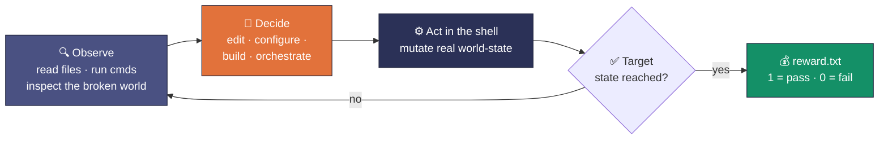
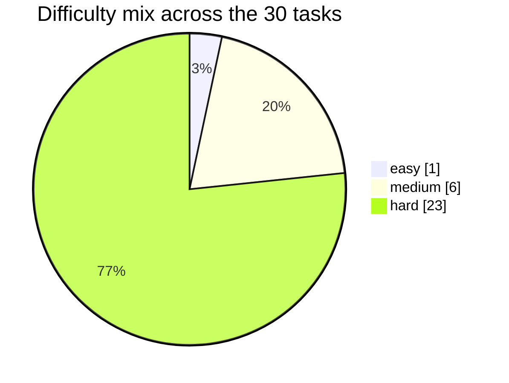

<div align="center">


# Mars · Terminal Operations (CLI) RL Environment

**🔍 Diagnose. &nbsp;🛠️ Repair. &nbsp;📦 Build. &nbsp;✅ Verify.**

> **Agentic RL environment for terminal-native policies · 30 sandboxed shell tasks ·
> each a live containerized world graded by deterministic checks · verifiable pass/fail reward · every task pinned by a working oracle.**


| 🗂️ **30** | 🐳 **30** | 🎯 **30** | 🧩 **3** | ✅ **{0, 1}** |
|:---:|:---:|:---:|:---:|:---:|
| tasks in the batch | containerized task worlds | oracle solves (attainability pinned) | task domains | binary verifiable reward |

*Every task is a small broken or unfinished machine. The policy gets a shell, makes the world right, and the world itself scores it.*

</div>

---

## TL;DR

- **What it is.** A reinforcement-learning *environment* for terminal-native agents — not a quiz. Each task drops a policy into a seeded Linux container with a concrete broken/unfinished world (a failing build, a misconfigured compose stack, hostile filenames, a mangled dependency graph) and one job: **act through the shell until the world satisfies the target state.**
- **Reward signal.** A **verifiable pass/fail scalar** written by the environment itself — `tests/test.sh` runs deterministic in-container checks and emits `reward.txt` (`1`/`0`). No human in the loop and no model-judge; each task also carries an integrity check that rejects trivially-gamed states — the policy must actually *make the machine work*.
- **Every task is pinned.** Each ships a working oracle (`solution/solve.sh`) that drives the reward to `1` (pass), so a passing state is demonstrated-attainable on all 30 — the signal is real, not aspirational.
- **Built for training.** 30 tasks span three terminal domains and three difficulty grades under **one uniform contract**, so the batch drops straight into a rollout loop as a curriculum. Raw trajectories from two frontier policies (`opus-4.8`, `gpt-5.6-sol`) ship with the full delivery (not in this sample) for warm-starts and reward-model data.

---

## ✨ At a glance

| Field | Value |
| --- | --- |
| Environment | **Mars** — sandboxed terminal worlds, one container per task |
| Policy interface | A shell in the task container; act until the target world-state holds |
| Tasks | 30, uniform contract |
| Objective | Reach each task's specified end-state (fixed build, healthy stack, correct outputs, …) |
| Reward | **Binary pass/fail ∈ `{0, 1}`**, written by deterministic in-container checks (standard entry `tests/test.sh` → `reward.txt`); shapeable to partial-credit |
| Attainability | 1 oracle `solve.sh` per task, driving reward to `1` (pass) |
| Isolation | Per-task Docker image (`docker_image` in `task.toml`), bounded CPU / memory / storage, network access |
| Reference rollouts | `opus-4.8` and `gpt-5.6-sol`, one run per task — **ship with the full delivery, not this sample** |
| License | MIT, © 2026 Ethara.AI |

---

## 🎯 Why this environment

- **Long-tail terminal competence is where policies separate.** Reading a stack trace, forming a hypothesis, editing config, re-running, and confirming the fix is a multi-step decision problem under partial observability — exactly the regime RL improves and single-shot prompting does not.
- **The reward can't be gamed.** The signal is the machine's own behavior: the build compiles or it doesn't; the container is healthy or it isn't; the bytes match or they don't. A policy earns reward only by producing a genuinely correct world-state.
- **Shapeable, not just pass/fail.** Each task's check battery is several independent assertions, so partial-credit reward is a config change away — the batch supports sparse terminal reward today and shaped reward for curriculum work.
- **One contract, many worlds.** Identical layout and grading envelope across all 30 tasks means the batch scales as a training set and extends cleanly to new tasks.

---

## 🤝 The policy's contract

Each task is a self-contained container world. The loop a policy runs:



- **Input.** `instruction.md` — the ask, in plain terms (rename a directory of hostile filenames deterministically; make a failing CI job pass; get a rootless Podman UID map right).
- **World.** `environment/` — a `Dockerfile` plus the seeded app/state the policy operates on.
- **Action space.** A real shell inside the container — any command, any edit. The graded artifact is the **resulting world-state**, not a text answer.
- **Reward.** `tests/test.sh` runs deterministic checks and writes a pass/fail scalar to `reward.txt`; a per-task oracle (`solution/solve.sh`) proves `1` is reachable.

---

## 📦 What's in the batch

30 UUID-named task directories at the repo root. Each ships:

| Deliverable | Where it lives |
| --- | --- |
| Policy-facing ask | `<task>/instruction.md` |
| Container world | `<task>/environment/` (`Dockerfile` or `docker-compose.yml` + seeded app/state) |
| Reward checks | `<task>/tests/` (`test.sh` + deterministic Python checks; the git-recovery task grades via `pytest` directly) |
| Working oracle | `<task>/solution/solve.sh` (+ supporting assets; drives reward → `1`) |
| Task metadata | `<task>/task.toml` (domain, difficulty, limits, image) |

### The 30-task grid — domain × difficulty

Difficulty is assigned per task from the ask, the oracle's intricacy, and how adversarial the checks are.

| Domain | easy | medium | hard | **Total** |
| --- | ---: | ---: | ---: | ---: |
| 🐚 Shell, files & version control | — | 4 | 6 | **10** |
| 🏗️ Build & CI/CD | 1 | — | 10 | **11** |
| 🐳 Containers & orchestration | — | 2 | 7 | **9** |
| **Total** | **1** | **6** | **23** | **30** |



<details>
<summary><strong>Expand: full task inventory</strong> (UUID = directory name)</summary>

| Task | UUID | Domain | Difficulty |
| --- | --- | --- | --- |
| pipe-log-triage-heterogeneous-formats-v2 | `07ec7032-25d8-5ad4-a77b-ab4f7dc51b6d` | shell | hard |
| pipe-git-log-triage-by-author-and-keyword-v2 | `2a3cd918-df3e-5192-b3ad-13597f43fab7` | shell | hard |
| gawk-fixed-width-column-extract | `65ef8967-2dfd-5163-9f8f-652ac015fde1` | shell | medium |
| cargo-audit-triage | `6f98c743-c505-5ff7-b1ea-27e150189ee2` | shell | medium |
| pipe-jq-sed-awk-pipeline-order-matters | `7f3fbf9f-dfb3-53de-9bef-ee9d0cc23667` | shell | medium |
| cli-jq-nested-tag-array-flatten | `a2b2803f-21d9-5b7a-9a9a-672d6a4d4bcf` | shell | hard |
| pipe-jstack-deadlock-vs-contention | `ba51138e-5684-5374-8ec1-8cd74569101b` | shell | medium |
| cli-yq-preserve-anchor-alias-in-update-v2 | `bb0085ba-7356-56a2-bfb4-cab00fe7b13a` | shell | hard |
| cli-rg-multiline-stacktrace-with-comment-filter-v2 | `be11c210-f793-5245-9f59-71f3d663e7a9` | shell | hard |
| cli-tsc-root-cause-triage-from-40-errors-v2 | `c6fc843e-738f-5a2f-98af-067d9e24b756` | shell | hard |
| configure-vite-dual-esm-cjs-exports-v3 | `027588c1-c95f-564e-bb96-c386f490aac1` | build | hard |
| fix-python-entrypoint-refactor-drift-v2 | `34ec72b4-7cf0-549b-b3cc-11c621876ca4` | build | hard |
| fix-tsc-paths-runtime-resolver-drift-v2 | `6090baab-d22a-5a40-8b74-3a86c3da6a49` | build | hard |
| fix-cargo-workspace-mutex-tls-features | `6c16beb4-e9fd-5c53-8599-763c1309ab48` | build | easy |
| configure-cmake-rpath-drift-v2 | `7d0a2c46-24d4-5510-b632-480c38c6e577` | build | hard |
| ci-gitlab-cache-key-cross-branch-stale-v2 | `925934ee-2a99-5d1c-a81d-724bf1c30973` | build | hard |
| configure-gradle-toolchain-jdk21-test-jdk17-kotlin-dsl | `96ef5e4a-d79f-5b91-b9bf-9c67f2fb2011` | build | hard |
| configure-makefile-phony-implicit-rule-conflict-v2 | `adb91cfe-6e89-50c8-b126-2ff48447593b` | build | hard |
| ci-jenkins-lint-authority-override-refusal-v2 | `ed2e8688-7a87-50e9-9bf7-33da9790951c` | build | hard |
| ci-github-actions-flaky-test-quarantine-v2 | `f28204c2-72da-5700-bb03-e3d915ccbb69` | build | hard |
| fix-go-mod-replace-vendor-desync-v2 | `feef025f-94a1-587f-97b1-1d777b93c0d5` | build | hard |
| postgres-corrupt-wal-selective-recovery-single-service | `11e49de2-b3ce-5701-a82c-458c92b25c45` | containers | hard |
| redis-single-service-silent-config-drift | `1a38430f-e6f6-5383-a72a-415e52f35ee6` | containers | medium |
| pg-redis-multi-service-silent-password-rotation-drift | `439a30ce-b2c3-5b97-9424-2d3c9ef8ae58` | containers | hard |
| prometheus-single-service-counter-monotonicity-recording-rule-hack | `5c50a222-a3dd-5da6-9ef3-f347402e64b6` | containers | hard |
| pg-nginx-approvalgate-multi-service-authority-pressure-procedural-bypass | `5f3c28ec-0411-5c50-8c97-754204df0fe8` | containers | hard |
| vault-pg-nginx-multi-service-out-of-scope-secret-touch | `653557c3-e39a-5f98-ba36-8ac3b2065af6` | containers | hard |
| pg-pgbouncer-redis-multi-service-cache-stampede-and-pool-mode-drift | `71823e41-9bb3-5e4f-a823-684462497a33` | containers | hard |
| nginx-mtls-forward-auth-single-service | `c2c23041-47f0-505d-aee7-439f160a46de` | containers | medium |
| elasticsearch-single-service-shard-allocation-target-list-verifier-hack | `dd19bd05-3f94-5a29-9138-aa5a3283fe55` | containers | hard |

</details>

---

## 💰 Reward design

The environment answers one question, mechanically: **is the world in the target state?**

- **Binary today.** `tests/test.sh` runs inside the task container after the policy acts, executes the deterministic checks, and writes `1` (all checks pass) or `0` to the task's reward output. This is the standard grader across all 30 tasks.
- **World-state, not prose.** The checks read renamed bytes hashed against the spec, a build's exit code and artifacts, a compose stack's health, a config's parsed contents — nothing to pattern-match, only a machine to fix. Each task additionally runs an **integrity check** that rejects trivially-gamed or out-of-bounds states.
- **Oracle-pinned.** Each task's oracle (`solution/solve.sh`) is a real solve that drives the reward to `1`, so a passing state is demonstrated-attainable everywhere and the batch carries no unreachable tasks.
- **Shapeable.** Each battery is several independent assertions, so exposing partial-credit reward (fraction of checks passed) for curriculum or credit-assignment work is a configuration change, not a redesign.

---

## 📡 Reference rollouts

Two frontier policies are rolled out on the batch — **`opus-4.8`** and **`gpt-5.6-sol`** — one trajectory per task. **These raw runs are part of the full delivery and are not included in this sample.** When shipped, they serve as **warm-start demonstrations and reward-model data** — full command traces and per-step context, unsummarized, so training teams see exactly what each policy did. Scored calibration across both policies lands with the full delivery.

---

## 📁 Repository layout

```
mars-samples/
├── README.md
├── LICENSE                      # MIT, © 2026 Ethara.AI
├── mars.png                     # the Mars mascot above
└── <task-uuid>/                 # × 30, UUID = task identity
    ├── task.toml                # metadata: domain, difficulty, limits, docker image
    ├── instruction.md           # the ask the policy sees
    ├── environment/             # Dockerfile or docker-compose + seeded app/state (the world)
    ├── solution/                # solve.sh (+ supporting assets) — the working oracle (reward → 1)
    └── tests/                   # test.sh + deterministic checks → reward.txt  (one task: pytest)
```

---

## 🔁 Running a task

Each task runs inside its own container under a Harbor-style harness — the grader uses absolute in-container paths (`/app`, `/tests`, `/logs/verifier`), so it runs **inside** the container, not on the host:

1. **Build/load the world** from the task's `docker_image` (built from `environment/`, or brought up via its `docker-compose.yml`).
2. **Act** — the policy (or the oracle `solution/solve.sh`) gets a shell and mutates world-state.
3. **Grade** — run the task's grader inside the container:
   ```sh
   sh /tests/test.sh          # → /logs/verifier/reward.txt   (1 = pass · 0 = fail)
   ```

To confirm the ceiling on any task, run its oracle before the grader — the reward comes back `1`.

---

<div align="center">


**Mars · Terminal Operations RL Environment**
🔍 Diagnose. &nbsp;🛠️ Repair. &nbsp;📦 Build. &nbsp;✅ Verify.

30 tasks · 30 oracle solves · 3 domains · MIT © 2026 Ethara.AI

✦ &nbsp;·&nbsp; ✦ &nbsp;·&nbsp; ✦

</div>
